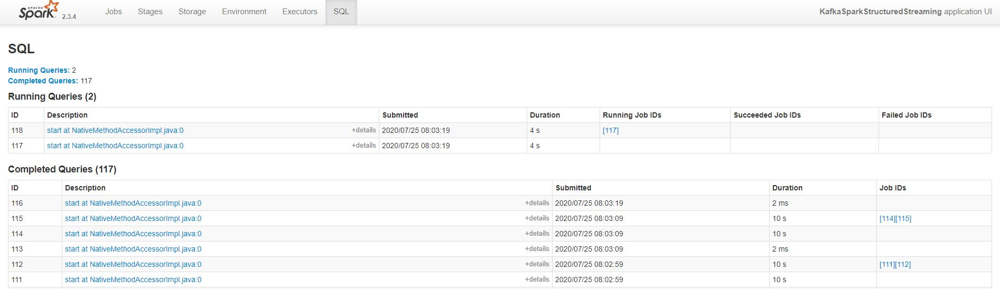

# SF Crime Statistics with Spark Streaming Project

## Introduction 

- findspark
- pyspark
- python-dateutil
- pathlib

## Running the application

1. Open a new terminal, and run `/usr/bin/zookeeper-server-start config/zookeeper.properties`
2. Open a new terminal and run `/usr/bin/kafka-server-start config/server.properties`
3. Install the required packages in a separate terminal window using `./start.sh`
4. Insert data into the topic by running the producer. Run the command `python kafka_server.py`
5. Verify that data is being produced. Execute the command `kafka-console-consumer --topic sanfran.police.calls --from-beginning --bootstrap-server localhost:9092`

6. Run the Streaming Application `data_stream.py` by executing `spark-submit --packages org.apache.spark:spark-sql-kafka-0-10_2.11:2.3.4 --master local[*] data_stream.py`

## Questions

1. How did changing values on the SparkSession property parameters affect the throughput and latency of the data?

It is important to understand the amount of data being processed to determine what effect toggling parameters will have on throughput. For example, increasing `maxOffsetPerTrigger` increased the amount of data being processed, but also increased latency.
Increasing memory too much has the effect of extreme delays in garbage collection. If the data is relatively small in the size, the driver memory, `spark.driver.memory` should be small as well. 

2. What were the 2-3 most efficient SparkSession property key/value pairs? Through testing multiple variations on values, how can you tell these were the most optimal?

Two of the most important SparkSession properties are `spark.streaming.kafka.maxRatePerPartition` and `spark.default.parallelism`. The former controls the maximum rate at which data is read from each Kafka partition, and the latter controls the number of partitions in RDDs returned by transformation functions. In local mode, this is limited to the number of cores on the machine.